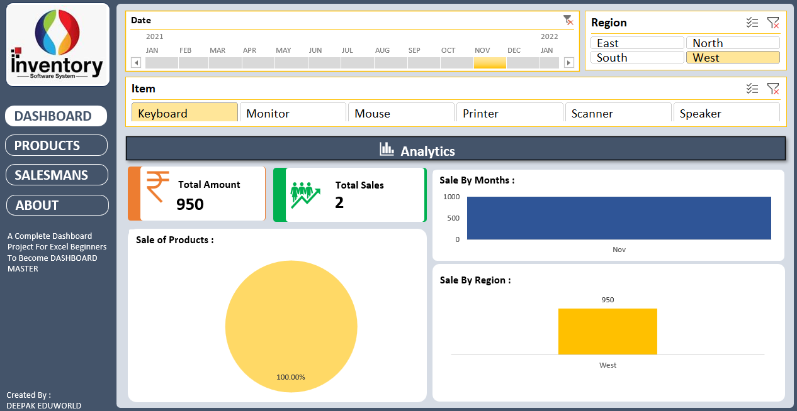
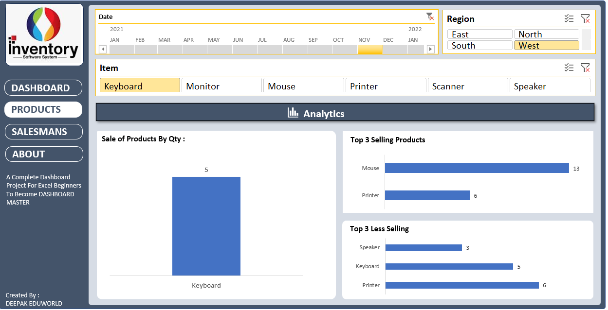
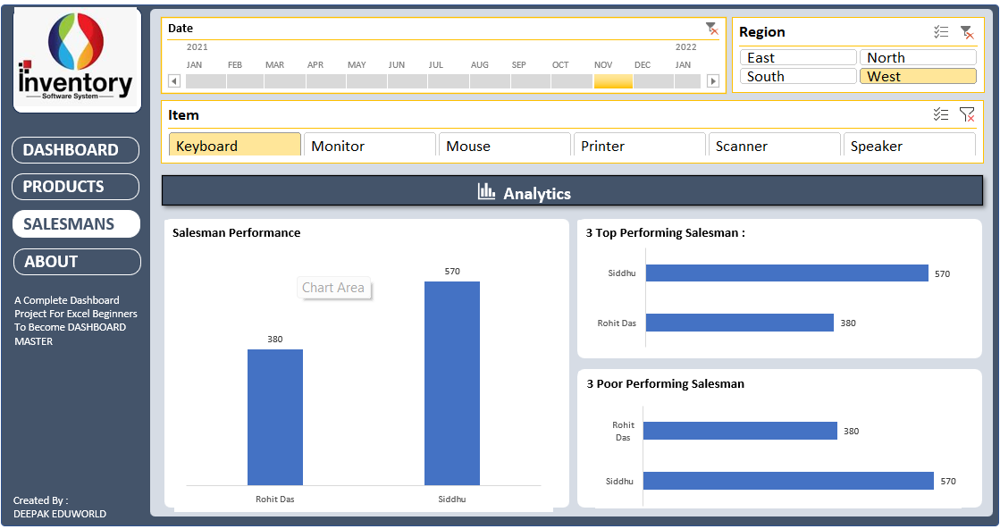

# Excel-Dashboard-for-Nokal-Shop
This is my Excel Dashboard Project. it's is real life problem solving base project for my nearest city shop.
# 📊 Excel Dashboard Project – Nokal Shop

## 🔹 Project Overview
This project is an Electronic Shop Inventory Dashboard created in Microsoft Excel.

It includes:
- Inventory Management
- Sales Dashboard
- Product Analysis
- Salesman Performance

---
## Project Display Overview
-<a href="https://github.com/Aman-moniya/Excel-Dashboard-for-Nokal-Shop/blob/main/Elecctronic_Shop_Inventory_FOR_Nokal_Shop.xlsx">Data Sheet View</a>
## 📌 Dashboard Preview

### Inventory Dashboard

### Product Dashboard

### Salesman Dashboard

---

## 🛠 Tools Used
- Microsoft Excel
- Pivot Tables
- Charts
- Formulas (SUMIFS, VLOOKUP, IF, COUNTIF)

---

## 📂 File Included
Electronic_Shop_Inventory_FOR_Nokal_Shop.xlsx
